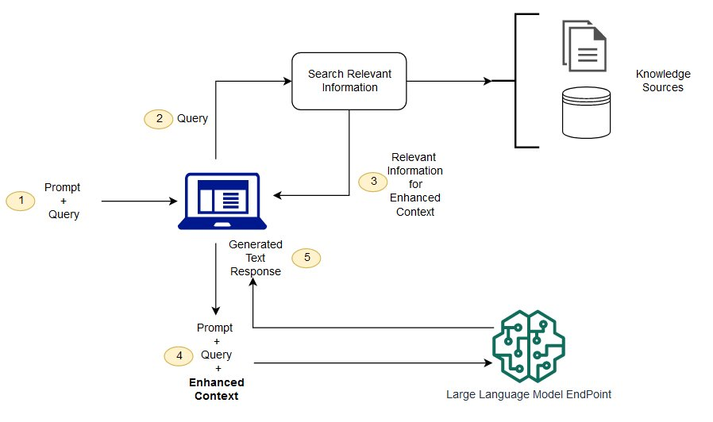
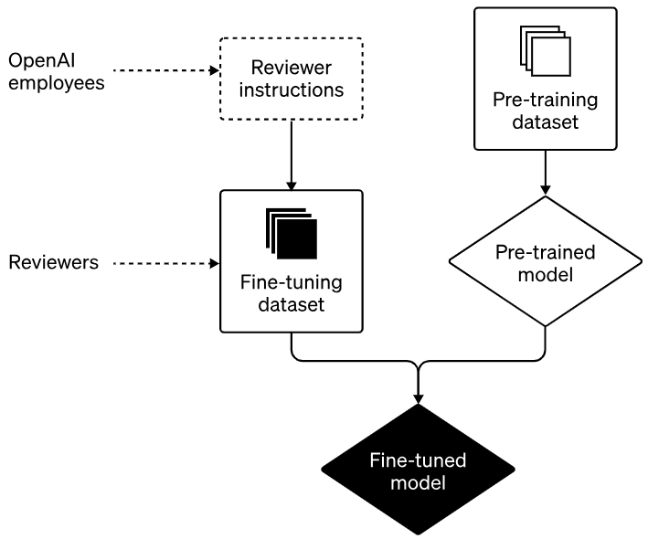
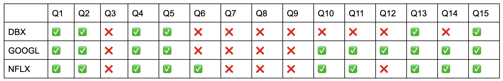
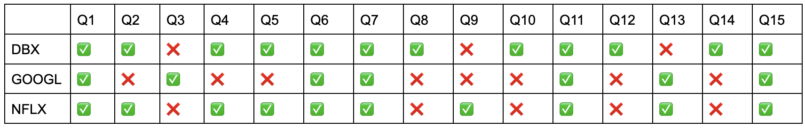

# AnoteML
## About
Developed for Anote, a NYC-based AI startup, this project features a LLM chatbot powered by various ML and NLP techniques. The chatbot answers domain-specific questions, with a particular focus on financial documents (such as 10-K documents).


## Installation and Usage
```
git clone https://github.com/eden-chung/AnoteML/
pip install -r requirements.txt
cd AnoteML/frontend
```
Usage:
```
streamlit run Home.py
```

## Goal
1. Create a LLM that can answer 10-K data more accurately than a generalized LLM such as GPT. 10-K documents are publically available yearly reports from companies.
2. Reduce the time and effort human analysts have to spend manually annotating and extracting information.
3. Finetune our model and feed in additional context in order to reduce the possibility of hallucinations to optimize the accuracy.

## Business Impact
1. The improved model will automate extracting key information and therefore people no longer need to spend time of tedious information look-up.
2. It will allow investors and stakeholders to get desired information more quickly and easily.


## Architecture

The model uses various techniques to improve the accuracy. To begin with, the pre-processing must first occur. The model mainly uses langchain to split the entire 10-K data (which is typically hundreds of pages long) into chunks, sections of the text, and convert the chunks into numerical representations, known as embeddings.

Once pre-processing has finished, the model uses Retrieval Augmented Generation (RAG), to store all the data from the 10-K in a database, known as the Knowledge Hub or Knowledge Source. This model uses ChromaDB, as it is hosted locally so is private. 
 
The model operates through a multi-step process. Upon receiving a question, it first uses a similarity search to find the most relevant chunk of the 10-K document to answer the given question from the Knowledge Hub. That selected section will then be brought into the LLM, which will then generate an appropriate  response based on the retrieved information.



The model is then fine-tuned with a training set of 40 data points to create an improved LLM. This step only has to be done once.




## Evaluation and Results
Our final model can take as a user input either a PDF of the 10-K or the company ticker, along with the question to ask. If the company ticker is inputted, then the 10-K will be automatically accessed via the EDGAR API.

To evaluate the model, 3 new 10-K documents were used: Dropbox, Google, and Netflix. 15 questions were asked on each 3 of these 10-Ks.

Results from the baseline model: GPT-3.5 Turbo

Overall accuracy: 58%

Results from our fine-tuned model: Fine tuned version of GPT-3.5 Turbo

Overall accuracy: 64%

It is clear that the fine-tuned model is still not 100% accurate. From the evaluation, the fine tuning increased the accuracy by 6% to 64%. This accuracy could be further improved had we had more time, which will be discussed below.


## Next Steps
In a limited time frame, and as full time college students, there were many limitations to the model that we recognized but were not able to address.

1. The model was trained using a training set that we manually created, meaning we had a very small training set. In addition, as students, we obviously do not have the best understanding of the answers that industry analysts may be seeking, and since our model is fine-tuned on this training data the accuracy could be further improved by having better, and more, training data.
2. The model uses ChromaDB and upon asking a question, creates a new database, then deletes it. This process is time-consuming and can take between 20-60 seconds for a single prompt, which is not ideal. The model could be improved by optimizing this performance.
3. Currently, the model uses OpenAI's GPT-3.5 as a base model. Ideally, the entire model could be hosted locally to reduce privacy concerns. Instead of using OpenAI's GPT-3.5, we could use a locally hosted model such as Meta's LLaMA.
4. The model is specific to 10-K documents right now, but to scale up, we could train the model to answer questions on other financial documents too. 


